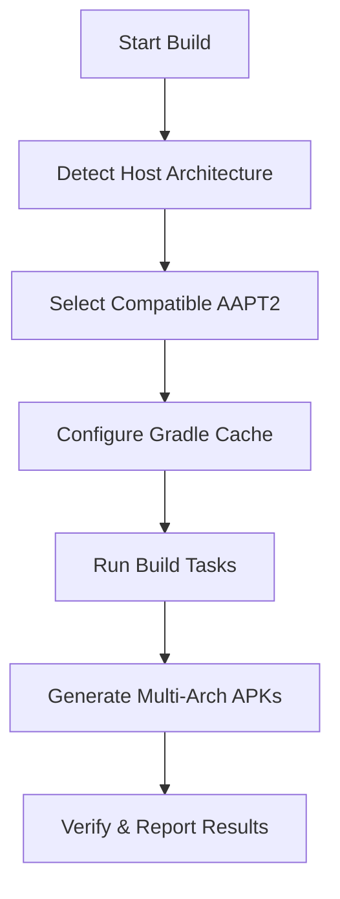

# 🦫 CleverFerret Universal Media Library

## 📖 Overview

CleverFerret is a comprehensive Universal Media Library Android application with **revolutionary multi-architecture build support** and **AI-powered development workflow**. This system automatically detects your development machine's architecture, configures the appropriate Android build tools, and uses AI to review every code change, ensuring seamless compilation and high-quality builds across **ARM64, x86_64, ARM32, and x86** architectures.

## 🏗️ Universal Build System

### Key Features

- **🎯 Automatic Architecture Detection**: Detects host system architecture automatically
- **🔧 Smart AAPT2 Configuration**: Uses architecture-specific AAPT2 binaries for optimal compatibility
- **📱 Multi-Architecture APK Generation**: Builds APKs for all major Android architectures
- **🚀 One-Click Building**: Single command builds across any machine architecture
- **🛠️ Comprehensive Tooling**: Integrated diagnostics, testing, and build verification

### Supported Architectures

| Host Architecture | Android ABI | AAPT2 Support | Status |
|------------------|-------------|---------------|---------|
| ARM64 (aarch64) | arm64-v8a | ✅ | Primary |
| x86_64 (amd64) | x86_64 | ✅ | Primary |
| ARM32 (armv7l) | armeabi-v7a | ✅ | Supported |
| x86 (i386/i686) | x86 | ✅ | Supported |

## 🚀 Quick Start

### Prerequisites

1. **Java 17+** (OpenJDK recommended)
2. **Android SDK** with Platform 34 and Build Tools 33.0.2+
3. **Git** (for cloning the repository)

### Installation

```bash
# Clone the repository
git clone <repository-url>
cd CleverFerret

# Make build scripts executable
chmod +x build-scripts/*.sh

# Run system diagnostics
./build-scripts/universal-build.sh info
```

### Building

```bash
# Quick build (detects architecture automatically)
./build-scripts/universal-build.sh build

# Full clean build
./build-scripts/universal-build.sh full-build

# Release build
./build-scripts/universal-build.sh build release

# Test environment
./build-scripts/universal-build.sh test-env
```

## 🔧 Architecture System

### How It Works

1. **Architecture Detection**: The build system automatically detects your host machine's architecture
2. **Tool Selection**: Selects the appropriate AAPT2 binary from the integrated android-tools repository
3. **Cache Management**: Intelligently manages Gradle caches to use compatible binaries
4. **APK Generation**: Builds APKs for all supported Android architectures

### Android Tools Integration

The project includes pre-compiled Android build tools from [JonForShort/android-tools](https://github.com/JonForShort/android-tools):

```
android-tools/
├── build/
│   ├── android-11.0.0_r33/    # Latest tools
│   │   ├── aapt2/
│   │   │   ├── arm64-v8a/bin/aapt2     # ARM64 binary
│   │   │   ├── armeabi-v7a/bin/aapt2   # ARM32 binary
│   │   │   ├── x86_64/bin/aapt2        # x86_64 binary
│   │   │   └── x86/bin/aapt2           # x86 binary
│   │   └── [other tools...]
│   └── android-9.0.0_r33/     # Fallback tools
└── README.md
```

### Build Process Flow



## 📱 Application Features

### Core Functionality

- **📚 eBook Library**: Support for EPUB, PDF, and text formats
- **🎵 Music Player**: Advanced audio playback with metadata support
- **🎬 Video Library**: Video file management and playback
- **🎧 Podcast Manager**: Podcast subscription and playback
- **📖 Calibre Integration**: Import and sync with Calibre libraries
- **🔍 Universal Search**: Search across all media types
- **🏷️ Smart Metadata**: Automatic metadata extraction and management

### Technical Stack

- **UI Framework**: Jetpack Compose with Material 3
- **Architecture**: MVVM with Hilt dependency injection
- **Database**: Room with SQLite
- **Media Playback**: Media3 ExoPlayer
- **Networking**: OkHttp3 with Kotlin Serialization
- **File Processing**: Apache Commons, iText7, JSoup

## 🛠️ Development Guide

### Project Structure

```
CleverFerret/
├── android-tools/              # Multi-architecture build tools
├── build-scripts/              # Universal build scripts
├── buildSrc/                   # Gradle plugins and build logic
├── CleverFerret/              # Main Android application
│   ├── src/main/java/         # Kotlin source code
│   ├── src/main/res/          # Android resources
│   └── build.gradle.kts       # App build configuration
├── docs/                      # Comprehensive documentation
├── builds/                    # Generated APK files
└── README.md                  # This file
```

### Build Commands

#### Universal Build Script

```bash
# Show system information
./build-scripts/universal-build.sh info

# Test build environment
./build-scripts/universal-build.sh test-env

# Debug build
./build-scripts/universal-build.sh build debug

# Release build
./build-scripts/universal-build.sh build release

# Clean and build
./build-scripts/universal-build.sh full-build

# Clean only
./build-scripts/universal-build.sh clean

# Help
./build-scripts/universal-build.sh help
```

#### Gradle Tasks

```bash
# Architecture information
./gradlew architectureInfo

# System diagnostics
./gradlew diagnose

# Configure android tools
./gradlew configureAndroidTools

# Build configuration info
./gradlew logBuildConfig

# Clean all
./gradlew cleanAll
```

### Environment Setup

#### Linux/macOS

```bash
# Install Java 17
sudo apt install openjdk-17-jdk  # Ubuntu/Debian
brew install openjdk@17          # macOS

# Set JAVA_HOME
export JAVA_HOME=/usr/lib/jvm/java-17-openjdk-amd64

# Install Android SDK
export ANDROID_HOME=/opt/android-sdk
export PATH=$PATH:$ANDROID_HOME/cmdline-tools/latest/bin
```

#### Windows

```powershell
# Install Java 17 (use installer from Oracle/OpenJDK)
# Set environment variables
$env:JAVA_HOME = "C:\Program Files\Java\jdk-17"
$env:ANDROID_HOME = "C:\Android\Sdk"
$env:PATH += ";$env:ANDROID_HOME\cmdline-tools\latest\bin"
```

## 🧪 Testing

### Automated Testing

```bash
# Run all tests
./gradlew test

# Run instrumented tests
./gradlew connectedAndroidTest

# Run specific test suite
./gradlew testDebugUnitTest
```

### Manual Testing

```bash
# Install debug APK
adb install -r builds/app-debug.apk

# Install specific architecture
adb install -r builds/app-arm64-v8a-debug.apk
```

## 🐛 Troubleshooting

### Common Issues

#### Build Fails with "AAPT2 Process Failed"

**Cause**: Incompatible AAPT2 binary for your architecture

**Solution**:
```bash
# Clean and reconfigure
./build-scripts/universal-build.sh clean
./gradlew configureAndroidTools
./build-scripts/universal-build.sh build
```

#### "Android Tools Not Found"

**Cause**: android-tools directory missing

**Solution**:
```bash
# Verify android-tools existence
ls -la android-tools/
./gradlew architectureInfo
```

#### "Java Version Not Supported"

**Cause**: Java version < 17

**Solution**:
```bash
# Check Java version
java -version
# Install Java 17+ and set JAVA_HOME
```

#### Memory Issues During Build

**Cause**: Insufficient heap memory

**Solution**:
```bash
# Set Gradle options
export GRADLE_OPTS="-Xmx4g -XX:MaxMetaspaceSize=1g"
```

### Diagnostic Commands

```bash
# Comprehensive system check
./gradlew diagnose

# Architecture detection test
./build-scripts/universal-build.sh info

# Build environment test
./build-scripts/universal-build.sh test-env

# Gradle configuration check
./gradlew architectureInfo
```

## 📚 Documentation

### Comprehensive Guides

- [**Build System Architecture**](docs/BUILD_SYSTEM.md) - Deep dive into the universal build system
- [**Android Tools Integration**](docs/ANDROID_TOOLS.md) - How android-tools are integrated
- [**Multi-Architecture Support**](docs/MULTI_ARCH.md) - Architecture compatibility details
- [**Troubleshooting Guide**](docs/TROUBLESHOOTING.md) - Common issues and solutions
- [**Development Setup**](docs/DEVELOPMENT.md) - Setting up development environment
- [**API Documentation**](docs/API.md) - Application architecture and APIs

### Architecture Documentation

- [**Application Architecture**](docs/architecture/APPLICATION.md)
- [**Build System Design**](docs/architecture/BUILD_SYSTEM.md)
- [**Database Schema**](docs/architecture/DATABASE.md)
- [**Media Processing Pipeline**](docs/architecture/MEDIA_PIPELINE.md)

## 🤝 Contributing

### Development Workflow

1. **Fork and Clone**
   ```bash
   git clone <your-fork-url>
   cd CleverFerret
   ```

2. **Setup Environment**
   ```bash
   ./build-scripts/universal-build.sh test-env
   ```

3. **Make Changes**
   - Follow existing code patterns
   - Add tests for new features
   - Update documentation

4. **Test Thoroughly**
   ```bash
   ./build-scripts/universal-build.sh full-build
   ./gradlew test
   ```

5. **Submit Pull Request**
   - Clear description of changes
   - Include test results
   - Update documentation if needed

### Code Style

- **Kotlin**: Follow official Kotlin coding conventions
- **Comments**: Document complex logic and architecture decisions
- **Testing**: Unit tests for business logic, integration tests for components

## 📄 License

This project is licensed under the Apache License 2.0 - see the [LICENSE](LICENSE) file for details.

The integrated android-tools are licensed under Apache 2.0 from the original [android-tools repository](https://github.com/JonForShort/android-tools).

## 🙏 Acknowledgments

- **JonForShort/android-tools** - Pre-compiled Android build tools for multiple architectures
- **Android Open Source Project** - Core Android development tools
- **Gradle Team** - Build automation system
- **Jetpack Compose Team** - Modern Android UI toolkit

## 📞 Support

### Getting Help

1. **Check Documentation**: Start with this README and the docs/ directory
2. **Run Diagnostics**: Use `./gradlew diagnose` for system analysis
3. **Search Issues**: Check existing GitHub issues
4. **Create Issue**: Provide system info and error logs

### System Information Template

When reporting issues, include:

```bash
# Run this command and include output
./gradlew diagnose
./build-scripts/universal-build.sh info
```

---

**🦫 CleverFerret - Universal Media Library with Universal Build Support**

*Build once, run everywhere. Develop anywhere, deploy everywhere.*