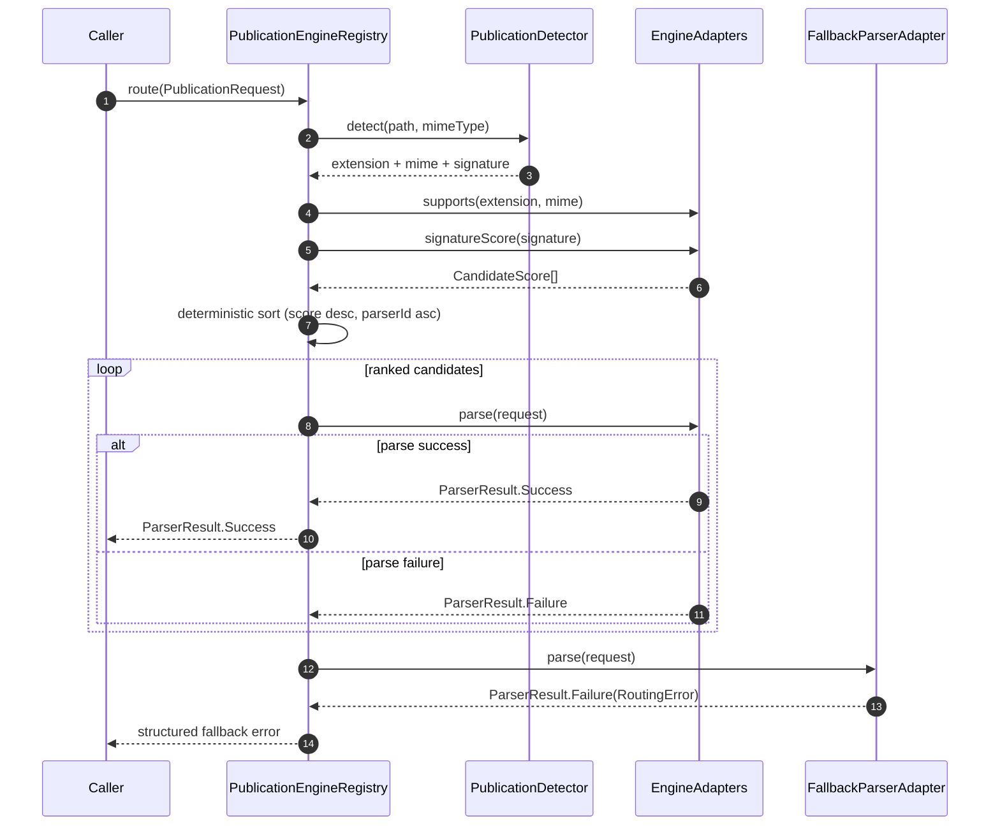

# Reader v2 Pipeline

## Overview

`feature:reader` now routes publication requests through a deterministic chain:

1. MIME + extension detection
2. Signature sniffing
3. Candidate parser ranking
4. Fallback parser with structured error reporting

The registry contract is defined by:

- `PublicationDetector`
- `PublicationParser`
- `PublicationRenderer`
- `PublicationSession`

## Engine Registry

### First-class adapters

| Adapter | Backing implementation | Formats | Readiness | First-class |
|---|---|---|---|---|
| `readium-epub` | `services/epub/ReadiumEpubService` | EPUB | `READY` | ✅ |
| `readium-pdf` | `services/epub/ReadiumPdfService` | PDF | `READY` | ✅ |
| `gemini-comic` | `services/comic/GeminiComicService` | CBZ/CBR/CBT/CB7 | `READY` | ✅ |
| `mobi-family-parser` | `parsers/impl/MobiParser` via `ParserFactory` | MOBI/AZW/AZW3 | `READY` | ✅ |
| `djvu-parser` | `parsers/impl/DjvuParser` via `ParserFactory` | DJVU/DJV | `LIMITED` | ✅ |
| `fallback-parser` | structured fallback adapter | all | `READY` | ✅ |

## Routing sequence

## Failure semantics

All failures are normalized as `RoutingError` and include:

- `stage`: where the failure occurred (`MIME_EXTENSION`, `SIGNATURE`, `RANKING`, `FALLBACK`)
- `code`: machine-readable error code
- `message`: human-readable detail
- `details`: stable key/value diagnostics
- `candidates`: ranked candidates returned by the deterministic chain

### Error examples

- Unknown publication with no matching parser:
  - `stage=FALLBACK`
  - `code=UNSUPPORTED_PUBLICATION`
- Known extension but parser unavailable:
  - `stage=RANKING`
  - `code=PARSER_NOT_AVAILABLE`
- Parser throws during execution:
  - `stage=RANKING`
  - `code=PARSER_EXECUTION_FAILED`

## Determinism guarantees

- Candidate score is always computed as `mime+extension score + signature score`.
- Sort order is stable and deterministic: higher score first, then lexical `parserId`.
- Fallback adapter is always attempted last.
